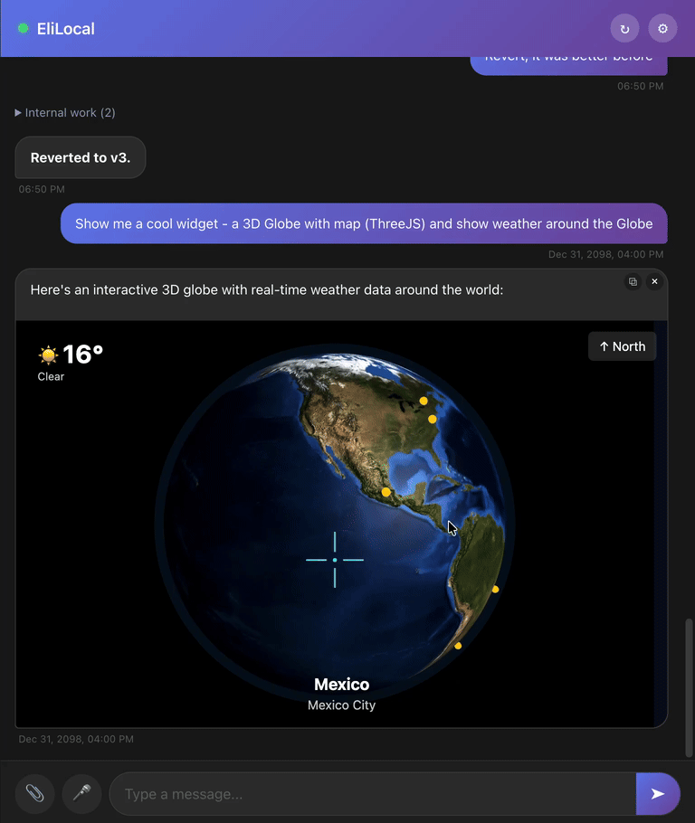

<p align="center">
  
</p>

# A Chat for Eliezer

A PWA chat interface with push notifications for AI agents that build interactive apps — live, inside the conversation.

Your agent doesn't just reply with text. It builds **widgets** — interactive HTML apps that render inline in the chat. A drum machine, a dashboard, a full landing page. The user asks, the agent ships, and the result is playable right there in the conversation.

## What makes it different

- **Widgets, not just words.** The agent can embed full interactive apps (iframes with shared state) inside chat messages. They resize, sync state across instances, and can be opened fullscreen.
- **Real-time everything.** SSE-powered live updates. Messages, agent status, widget state changes — all push, no polling.
- **Installable PWA.** Works as a native app on iOS, Android, and desktop. Push notifications when you're away.
- **Agent is a plugin.** The chat server runs independently. Agents connect via a local API, crash without taking down the UI, and replay missed events on reconnect.
- **8k lines, no framework bloat.** SolidJS frontend, Express backend, SQLite storage. Runs in Docker or on a $6 VPS.

## Quick start

```bash
git clone https://github.com/Eliezer-app/clawchat.git
cd clawchat
make dev
```

Open [localhost:3102](http://localhost:3102). That's it.

**Prerequisites:** Docker and Docker Compose.

## Project structure

```
server/          Express API + agent integration
client/          SolidJS SPA (Vite)
shared/          Shared TypeScript types
apps/            Widget apps (served at /widget/<app-id>/)
deploy/          systemd + nginx + SSL setup
docs/            Architecture docs, widget API reference
```

## Development

```bash
make dev          # Start with your agent
make connect-dev-agent   # Start with dev agent
make connect-mock-agent  # Start with mock agent (no API keys needed)
make logs         # Follow container logs
make invite       # Generate an auth invite token
```

| Service | URL | Auth |
|---------|-----|------|
| Client (dev) | localhost:3102 | Cookie |
| Public API | localhost:3101 | Cookie |
| Agent API | localhost:3100 | None (local only) |

## Production deployment

```bash
cd deploy
make setup DOMAIN=chat.example.com
make deploy
```

Sets up systemd services, nginx reverse proxy, and Let's Encrypt SSL. See [`deploy/Makefile`](deploy/Makefile) for all targets.

## The widget system

Agents embed widgets by including an `<iframe>` tag in their message. Two flavors:

- **Inline** — `data:text/html` URI, zero setup, sandboxed
- **File-based** — static HTML served from `apps/<id>/public/`, with optional server-side API routes and persistent state

Widgets get auto-resizing, shared state via a versioned API, and SSE sync across all open clients. Full docs in [`docs/widgets.md`](docs/widgets.md).

## Architecture

```
User  <-->  SolidJS Client  <--SSE/REST-->  Express Server  <--Event Queue-->  Agent
                                                  |
                                              SQLite DB
                                           (messages, state,
                                            sessions, push)
```

The agent is a separate process that connects to the server's local API. It receives events (new messages, deletions, state changes) via a durable SQLite-backed queue and responds with actions (send message, update widget state, etc.). If the agent goes down, the chat keeps working. When it reconnects, it replays everything it missed.

Full architecture docs in [`docs/agent-architecture.md`](docs/agent-architecture.md).

## License

MIT
